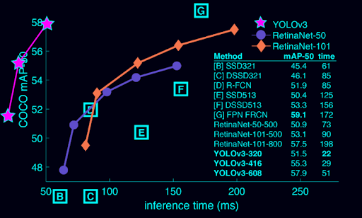
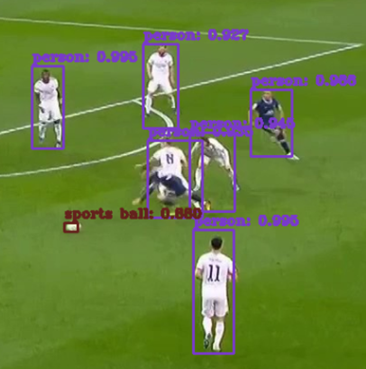
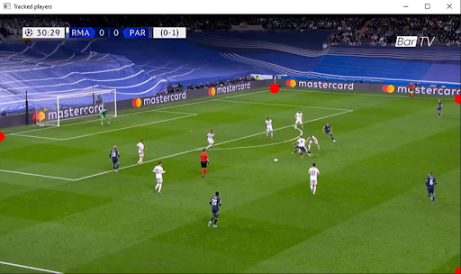
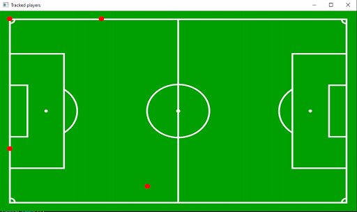
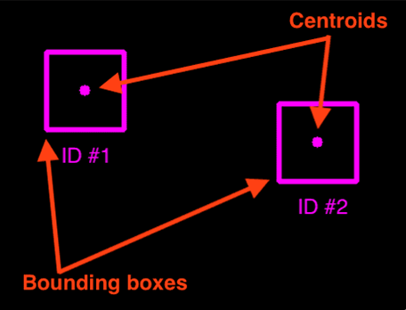
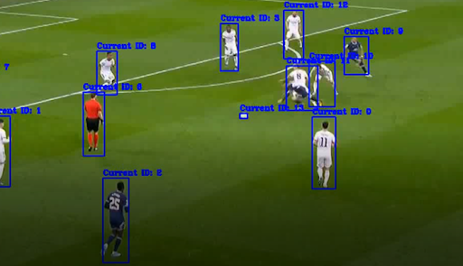
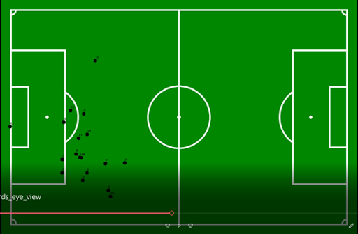

# Player tracking Spor

The development of a machine learning model within the artificial vision area, specifically the conceptualization of a neural network, has been implemented as a concept with the purpose of being able to identify players and a football taking a video as input and generating a bird's-eye view where each point corresponds to a player relative to the field.

For the project, a pre-trained model: YOLOv3 has been trained by the darknet team, using the COCO dataset which provides the recognition of 80 categories of objects and 330,000 images of which more than 200,000 are labeled with the correct objects. In addition, powerful libraries such as OpenCV and NumPy have been used to apply the model to the video input, as well as generating the bird's eye-view. In order to track the targets, the algorithm created by Adrian Rosebrock based on the 'tracking centroids' algorithm has been used: https://pyimagesearch.com/2018/07/23/simple-object-tracking-with-opencv/.

The work carried out consisting in the investigation of visual detection and tracking of objects in real time, serves as a basis for future projects that require knowledge in this area and can use it as an aid to develop other projects, since I consider that the results obtained are precise enough to provide added value to the application for future marketing, opening the door to the incorporation of additional Artificial Intelligence functionalities.
 
These part of the project is discussed in more detail in sections 4.6 and 5.3 of the written report, which I highly recommend visiting: https://github.com/riniguez91/Spor/blob/main/Memoria%20Spor.docx

Note: The written report is written in Spanish

# Screenshots

* YOLO performance

* YOLO results

* Birds eyes reference points

* Centroid tracking

* YOLO with centroid tracking

* Birds eye view

